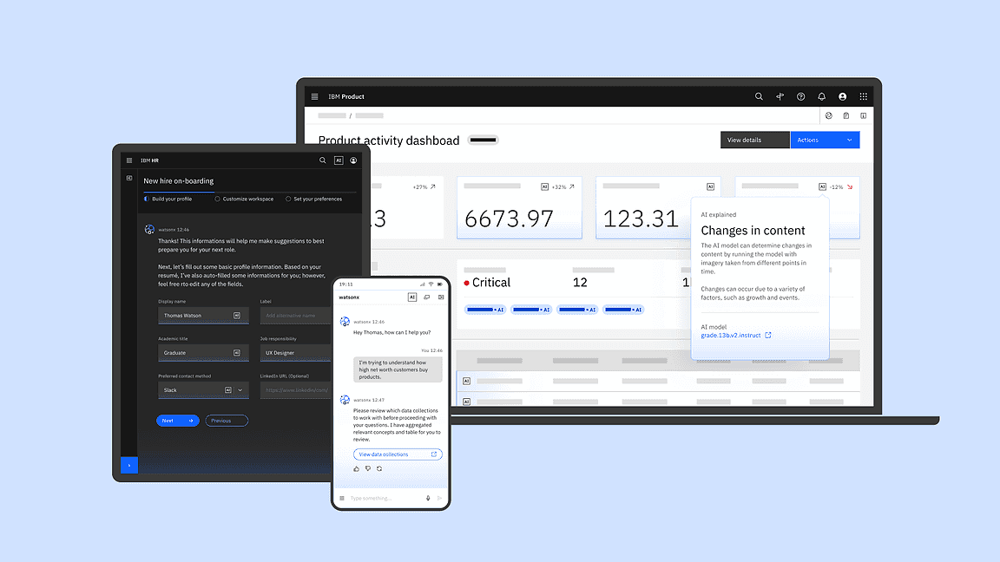

.. CarbonKivy documentation master file, created by
   sphinx-quickstart on Thu Mar 13 13:05:51 2025.
   You can adapt this file completely to your liking, but it should at least
   contain the root `toctree` directive.

CarbonKivy - Carbon Design Kivy
===============================

.. rst-class:: lead

    A Library providing IBM's Carbon Design Components for `Kivy <https://kivy.org>`_.

Introduction
------------

CarbonKivy is a Python library that integrates IBM's `Carbon Design System <https://www.carbondesignsystem.com/>`_ with the Kivy framework. It provides a modern, accessible, and user-friendly UI toolkit inspired by Carbon’s design principles, enabling developers to create consistent and visually appealing applications in Kivy.
CarbonKivy is a next-generation toolkit for developers looking to create professional-grade applications using the power of Kivy coupled with the design excellence of `Carbon Design principles <https://carbondesignsystem.com/all-about-carbon/the-carbon-ecosystem>`_.

Why CarbonKivy?
---------------

CarbonKivy is more than just a framework—it's a philosophy of professional application design. With features tailored for both backend functionality and frontend aesthetics, this toolkit bridges the gap between coding and creativity.
Designed with both creativity and performance in mind, CarbonKivy empowers developers to build stunning, feature-rich applications with ease. Whether you're a seasoned developer or just starting with Kivy, this framework provides the tools and resources to bring your ideas to life.

Getting Started
---------------

Explore the full capabilities of CarbonKivy by diving into the documentation. Let's build better, together!

.. toctree::
    :hidden:

    Introduction <self>

.. toctree::
    :hidden:

    carbondesignsystem
    contributing
    financialsupport

.. tab-set::

    .. tab-item:: Elements

        Basic Elements of the CarbonKivy library.

        .. toctree::
            :maxdepth: 2
            :glob:

            elements/index

    .. tab-item:: Components

        List of the available Components of the CarbonKivy library.

        .. toctree::
            :maxdepth: 2
            :glob:

            uix/index

    .. tab-item:: API

        .. toctree::
            :maxdepth: 4
            :glob:

            autoapi/index

.. toctree::
    :hidden:

    build_instructions/index
    devtools/index